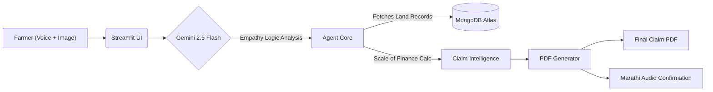

# 🌾 Viksit Kisan (The AI Agri-Agent)

> **Team:** Viksit Kisan | **Event:** GenAI Hackathon Mumbai | **Track:** AgriTech  
> **Status:** 🏆 Top 75 Finalist (Top 15%) | 🟢 Live Prototype

  
  
  
    

---

## 📖 The Problem: "The Systemic Reject"
In Maharashtra alone, **4,30,443 crop damage claims** were rejected in a single season. Most weren't fraudulent—they were legitimate losses disqualified by systemic barriers:

1. **The 72-Hour Window:** Reporting is too complex to navigate during a crisis.
2. **The Language Trap:** Even in regional languages, claims are rejected due to minor technical entry mistakes (confusing terminology/formats).
3. **The 'Black Box':** Farmers have no way to verify the compensation they are actually owed.

**Viksit Kisan** solves this. We built a 'Digital Talathi' that acts as an intelligent bridge between the distressed farmer and the rigid insurance portal.

---

## 🚀 Key Features

### 🧠 "Empathy Logic" Engine
Standard AI might reject a muddy photo as "unclear." We tuned our Gemini prompts to recognize **"waterlogged soil"** as valid proof of damage. We prioritized the farmer's reality over rigid algorithmic rules.

### 🗣️ Dialect-Native Input
No typing required. The agent understands **Varhadi/Marathi/Hindi** dialects directly. Just speak: *"Maza kapus gela"* (My cotton is gone), and the system processes it.

### 👁️ Multimodal Intelligence
Uses **Gemini 2.5 Flash Vision** to analyze raw 7/12 Land Extracts (Satbara). It extracts critical data like `Survey Number` and `Owner Name` even from low-quality, shadowed photos.

### 📊 Claim Intelligence & PDF Generation
We don't just give advice; we generate the **actual application form**.
* **Auto-Fill:** Maps voice + image data to the official claim format.
* **Payout Estimator:** Uses the **2025 Scale of Finance** (e.g., ₹60k/Ha for cotton) to show Ramdas Bhau exactly what he is owed.
* **Legally Valid PDF:** Generates a Marathi application using advanced text shaping (Devanagari support).

---

## 🛠️ The Tech Stack

| Component | Technology | Role |
| :--- | :--- | :--- |
| **The Brain** | **Google Gemini 2.5 Flash** | Multimodal reasoning (Audio + Image -> JSON). |
| **Orchestration** | **Google Gen AI SDK** | Managing prompt chains and context. |
| **Frontend** | **Streamlit** | Mobile-first UI for Camera & Mic input. |
| **Database** | **MongoDB Atlas** | Storing user profiles, scheme rules, and claim history. |
| **PDF Engine** | **fpdf2 + uharfbuzz** | Generates legally valid Marathi claim forms. |
| **Audio Output** | **gTTS** | Converts the Agent's reply back to Marathi Audio. |
| **Data** | **MongoDB Atlas** | Stores scheme rules and User Profiles. |

---

## 🏗️ Architecture Flow

---

## 📚 Documentation & Quick Links

| 🚀 Live Application | 💻 GitHub Repository | 📁 Project Presentation |
| :---: | :---: | :---: |
| [**Launch App**](https://viksit-kisan.streamlit.app) | [**View Code**](https://github.com/aryadharmadhikari/Viksit_Kisan) | [**Visit Drive**](https://drive.google.com/drive/folders/1lI59cBUwZR0_iGEsoYMplEHFIQ62Bq39) |
